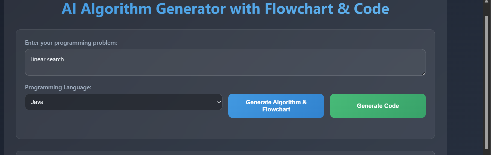
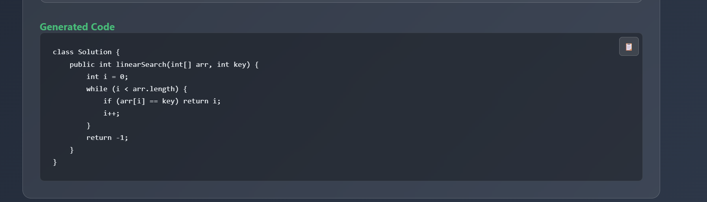

AI Algorithm + Flowchart + Code Generator
========================================

Generate clear step-by-step algorithms, Mermaid flowcharts, and minimal working code for multiple languages (Python, Java, JavaScript, C++, C#) from a natural language problem statement.


Overview
--------
This app lets you type a problem like “Implement Binary Search” and produces:
- A numbered algorithm (human-readable)
- A Mermaid.js flowchart (rendered in-browser)
- Minimal code in a selected language

It uses Google Gemini for text generation and Mermaid.js for visualization.

Features
--------
- Clean UI with dark theme
- Robust algorithm and flowchart generation
- Language dropdown (Python, Java, JavaScript, C++, C#)
- Minimal “essential-only” code output (no verbose explanations)
- Python-specific indentation fixer to ensure valid syntax
- Copy-to-clipboard for generated code
- Graceful error handling and raw Mermaid fallback when rendering fails

Tech Stack
---------
- Backend: Flask (Python)
- AI Model: Google Gemini (via google-generativeai)
- Frontend: Vanilla HTML/CSS/JS
- Visualization: Mermaid.js
- Env Management: python-dotenv

Requirements
------------
- Python 3.9+
- Google API key for Gemini
- Internet connectivity (to call Gemini APIs and load Mermaid.js CDN)

Install
-------
1) Clone the repo
   - GitHub (HTTPS):
     https://github.com/manukrishna804/webscrap.git

2) Create and activate a virtual environment
   - Windows PowerShell:
     python -m venv .venv; . .venv\Scripts\Activate.ps1
   - macOS/Linux (bash/zsh):
     python3 -m venv .venv && source .venv/bin/activate

3) Install dependencies
   pip install -r requirements.txt

If you don’t have requirements.txt, create it with:
```
flask
flask-cors
python-dotenv
google-generativeai
```

Environment Variables
---------------------
Create a `.env` file in the project root:
```
GOOGLE_API_KEY=your_google_gemini_api_key
```

Running the App
---------------
- Windows PowerShell (note: use `;` as the separator, not `&&`):
  cd C:\Users\<you>\path\to\project; python app.py

- macOS/Linux:
  cd /path/to/project && python app.py

The server starts at http://127.0.0.1:5000

Usage
-----
1) Open the app in your browser
2) Enter a problem statement, e.g. “Implement binary search”
3) Click “Generate Algorithm & Flowchart”
4) Review the steps and the diagram
5) Pick a language and click “Generate Code”
6) Copy the code using the copy icon

API Endpoints
-------------
- GET `/` → Serves UI
- GET `/health` → Health/status JSON
- POST `/generate-algorithm` → Body: `{ "coding_question": string }`
  - Returns: `{ "algorithm": string }`
- POST `/generate-flowchart` → Body: `{ "algorithm": string }`
  - Returns: `{ "flowchart": string /* Mermaid code */ }`
- POST `/generate-code` → Body: `{ "algorithm": string, "programming_language": "python|java|javascript|cpp|csharp" }`
  - Returns: `{ "code": string }`

Screenshots
-----------





Troubleshooting
---------------
- PowerShell separator:
  - Use `;` between commands, not `&&`.
- 401/403 from Gemini:
  - Verify `GOOGLE_API_KEY` in `.env` and that it’s active for Gemini.
- Mermaid rendering error:
  - The UI shows raw Mermaid code if rendering fails. Verify it starts with `flowchart TD`.
- Python indentation looks wrong in output:
  - The app runs a post-processor to fix indentation. If you still see issues, paste into a Python formatter (e.g., `black`) after copying.

